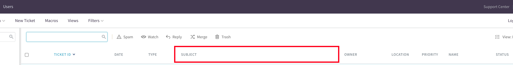
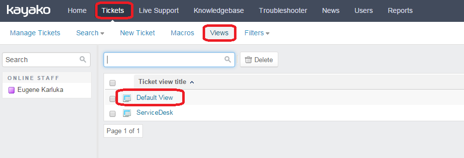
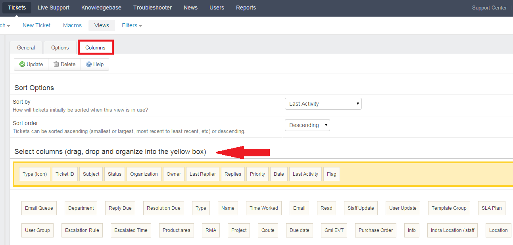

# Column Width Limit

With `Column Width Limit` you can prevent the `Subject` field from shrinking when adding more columns to the `Ticket` overview.



> This manual modification replicates the functionality of the [`Column Width Limit plugin`](https://www.kayako-solutions.com/column-width-limit).

Unlike the original plugin (which provides configuration options in `Admin CP → Home → Settings → Field Settings`), this version applies the same restrictions manually by editing the PHP and JavaScript source files.

The goal is to ensure that long ticket titles remain visible, with text truncation minimized while preserving layout stability across all ticket list views.

## Step 1. Adjusting the “Subject” Column Width

Open:

```shell
nano __apps/tickets/staff/class.View_Manage.php
```

Locate the line:

```php
$_fieldContainer['tickets.subject'] = '<div class="subjectspancontainer" style="min-width:333px;"><span class="subjectspan" style="float: left;">' . //...
```

Change the minimum width from `333px` to your preferred width (for example, `500px`):

Before:

```php
style="min-width:333px;"
```

After:

```php
style="min-width:500px;"
```

This defines the minimum width of the `Subject` column, ensuring it remains readable when more columns are added to the ticket view.

## Step 2. Fixing Text Truncation in “Subject”

To ensure the subject text uses almost the full column width without clipping, update the JavaScript responsible for rendering text.

Open:

```shell
nano __swift/apps/base/library/UserInterface/class.SWIFT_UserInterfaceControlPanel.php
```

Locate the line:

```php
echo '$(document).ready(function(){if($(\'.subjectspancontainer\').length){var subjectcontainerwidth = ($(\'.subjectspancontainer\')[0].clientWidth - 100);$(\'.subjectspan > a:first-child\').css({"max-width" : subjectcontainerwidth});}});';
```

Reduce the padding value from `- 100` to `- 25` so the text fills more of the available width.

Before:

```php
clientWidth - 100
```

After:

```php
clientWidth - 25
```

This leaves a small right margin but allows almost the entire subject line to be displayed.

## Step 3. Verification

Remember, when you add a variety of different columns in the ticket list, all columns of the table reduce their width to fit the screen, but `Subject` column will never be compressed more than the value specified in the settings. To add a new column, in the `Staff CP`, go to `Tickets → Views → Default View`.



Choose the `Columns` tab.



> `Subject` width can’t be less than the value specified in the source files, but it can be larger.